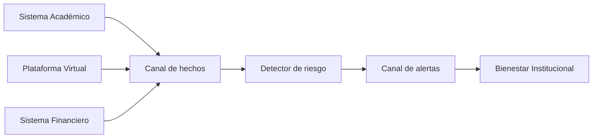
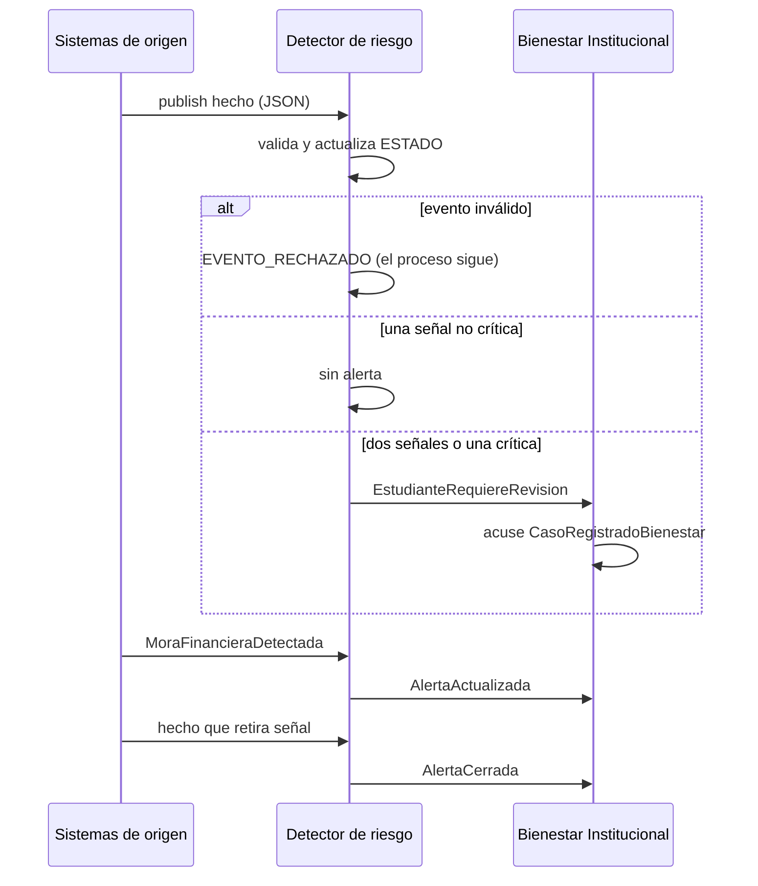

# Proyecto de interoperabilidad e integración de sistemas

**Detección oportuna de estudiantes que requieren acompañamiento**

| Campo | Valor |
|---|---|
| Grupo | Santiago Soto · Sergio Guzmán · Benis Gómez |
| Entrega | 23 de septiembre de 2026 |
| Sustentación | 24 de septiembre de 2026 |
| Entregable ejecutable | `Proyecto_Interoperabilidad_Bienestar.ipynb` |

Este README explica el proyecto completo para GitHub y para la lectura previa a la sustentación. El entregable que se ejecuta es el cuaderno; no este archivo.

---

## Índice interno

1. [Cómo clonar y ejecutar](#cómo-clonar-y-ejecutar)
2. [Pregunta central y respuesta](#pregunta-central-y-respuesta)
3. [Problema](#problema)
4. [Sistemas](#sistemas)
5. [Requisitos](#requisitos)
6. [Alternativas](#alternativas)
7. [Arquitectura](#arquitectura)
8. [Qué es MQTT](#qué-es-mqtt)
9. [Tecnología](#tecnología)
10. [Flujo](#flujo)
11. [Regla de alerta](#regla-de-alerta)
12. [Topics](#topics)
13. [Contratos](#contratos)
14. [Escenario EST001](#escenario-est001)
15. [Pruebas](#pruebas)
16. [Limitaciones](#limitaciones)
17. [Estructura del repositorio](#estructura-del-repositorio)

---

## Cómo clonar y ejecutar

```bash
git clone <URL-de-este-repositorio>
cd <directorio-del-clone>
```

Abrir `Proyecto_Interoperabilidad_Bienestar.ipynb` con kernel **Python 3**. Sirve **VS Code**, **Cursor**, **Jupyter** (Lab o Notebook) y **Google Colab**.

**No usar Run All.** Hay `input()` en las celdas **25, 27 y 29** (productores interactivos). Eso bloquea el kernel.

| Paso | Celdas | Qué hace |
|---|---|---|
| 1 | **17 → 18 → 19** | Instala `paho-mqtt>=2.0`, carga constantes y funciones auxiliares |
| 2 | **21** y **23** | Arranca Detector de riesgo y Bienestar Institucional (`loop_start()`) |
| 3 | **31** | Escenario automático EST001 (etapa 15) |
| 4 | **33–36** | Cuatro pruebas de la etapa 16 |
| 5 | celda de código | Para detener, llamar `detener_cliente("detector")`, `detener_cliente("bienestar")` o `detener_todos()` (funciones definidas en la celda **19**). La celda **40** es markdown: solo documenta eso; no se ejecuta. |

**Demo de clase:** ejecutar Detector, Bienestar y el escenario de la etapa 15. Saltar las celdas con `input()`.

Internet es obligatorio. El prototipo publica y consume en `broker.emqx.io:1883` **sin TLS y sin autenticación**. Prefijo de topics: `uni/soto-guzman-gomez/`. En el broker público **cualquiera puede suscribirse o publicar** en esos topics; por eso se usan identificadores ficticios (`EST001`, …) y **nunca PII real**. Si el broker público no responde, la demo no corre.

---

## Pregunta central y respuesta

**Pregunta del enunciado (sección 3):** ¿Cómo puede la universidad utilizar información de sus diferentes sistemas para identificar oportunamente estudiantes que podrían requerir acompañamiento de Bienestar Universitario?

**Respuesta del equipo:** no se reemplazan Académico, Virtual, Financiero ni Bienestar. Se añade un **correlador** (Detector de riesgo) que escucha hechos ya registrados, cruza señales por `codigo_estudiante` y periodo, y avisa a Bienestar solo cuando la regla de revisión se cumple.

---

## Problema

Bienestar debe acompañar a tiempo. Hoy los indicios ya existen, pero cada uno vive en un silo: el Sistema Académico guarda caídas de promedio y cancelaciones; la Plataforma Virtual guarda inactividad; el Sistema Financiero guarda mora. Bienestar solo ve solicitudes, remisiones y atenciones propias.

Ejemplo del recorte: en un mismo periodo una estudiante baja de **4.2 a 2.9**, acumula **18 días** sin entrar al aula virtual y entra en **mora**. Cada hecho queda en su sistema. Bienestar se entera cuando ella pide cita, cuando un docente remite o cuando el semestre ya avanzó.

El fallo no es falta de datos: es **falta de oportunidad**. La identificación tardía encarece el caso (cancelación masiva, pérdida de matrícula, deserción) y satura la agenda de Bienestar con situaciones ya graves.

---

## Sistemas

El enunciado nombra cuatro sistemas de negocio. El prototipo los usa los cuatro. El Detector **no** es un quinto sistema de atención: es un componente de integración.

| Sistema | Rol en el prototipo | Qué origina o consume |
|---|---|---|
| Sistema Académico | productor | promedio, delta, cancelaciones |
| Plataforma Virtual | productor | inactividad y participación |
| Sistema Financiero | productor | mora y regularización |
| Bienestar Institucional | consumidor | recibe la alerta resumida, no los silos crudos |
| Detector de riesgo | correlador de integración | cruza señales y publica revisión / actualización / cierre |

El identificador canónico de intercambio es `codigo_estudiante` ficticio (`EST001`, …). Sin esa llave compartida no hay correlación. No viajan cédulas ni expedientes.

Siete problemas de interoperabilidad que el diseño debe atacar:

| Problema | En este caso |
|---|---|
| Silos | Académico, Virtual, Financiero y Bienestar operan por separado; una caída de promedio no avisa a Bienestar |
| Heterogéneos | tecnologías y modelos distintos; no se reescriben núcleos |
| Tiempos | los hechos no ocurren juntos; una consulta puntual no basta |
| Identificador | hace falta un código canónico entre sistemas |
| Contrato | hace falta un sobre común de “hecho ocurrido”, no consultas ad hoc |
| Oportunidad | el aviso debe poder salir al ocurrir el hecho, no en un lote tardío |
| Privacidad | Bienestar recibe un resumen accionable, no el detalle de cartera ni el log del LMS |

---

## Requisitos

Los requisitos salen del problema, no de una tecnología previa.

| ID | Requisito (una línea) |
|---|---|
| REQ-01 | Los hechos se intercambian **cuando ocurren**, no solo cuando alguien consulta. |
| REQ-02 | La alerta llega con **oportunidad**, antes de un lote o de una remisión tardía. |
| **REQ-03** | **No se modifican los núcleos** de Académico, Virtual, Financiero ni Bienestar; solo adaptadores. |
| REQ-04 | Intercambio con **contrato** estructurado (nombre del hecho, tiempo, origen y `data`). |
| **REQ-05** | Un mensaje inválido se **rechaza y se registra**; el proceso no cae. |
| **REQ-06** | El **fallo de un consumidor** no detiene a los productores ni al correlador. |
| REQ-07 | Un sistema nuevo se suma como **nueva publicación o suscripción**, sin reescribir a los demás. |
| REQ-08 | Cada hecho lleva `event_id`; la alerta cita los eventos origen. |
| REQ-09 | Mínimo de datos personales: código ficticio, nombre de prueba y métricas del hecho. |
| **REQ-10** | **Correlación** por estudiante y periodo: un hecho no crítico aislado **no** abre alerta; una señal crítica **sí** (cancelación total, inactividad ≥ 21 días o mora ≥ 30). |
| **REQ-11** | Un hecho de **actualización** (recuperación de promedio o pago regularizado) retira la señal y cierra o actualiza la alerta. |

REQ-10 es el corazón del prototipo: si una sola baja de nota abriera el caso, no habría interoperabilidad, sino un `if` local en Académico. REQ-03 fija que la universidad no reemplaza sistemas. REQ-05 y REQ-06 fijan que un payload malo o un Bienestar caído no tumba el resto.

---

## Alternativas

Se compararon dos estilos de integración **antes** de elegir tecnología.

| | Alternativa A | Alternativa B |
|---|---|---|
| Idea | Eventos asíncronos + correlador | REST síncrono: Bienestar (o un gateway) consulta los tres núcleos |
| Oportunidad | el hecho se emite al ocurrir | la información viaja cuando alguien pregunta |
| Acoplamiento | los productores no conocen a Bienestar | Bienestar conoce tres APIs |
| Fallo | el resto sigue publicando o escuchando | una API caída corta o degrada el expediente |
| Sistema nuevo | nueva publicación o suscripción | cambiar el orquestador |
| Encaje con el enunciado | tiempos distintos y núcleos intocados | útil para consulta, débil para detección oportuna |

**Selección: A.** El problema es que Bienestar ve tarde una confluencia de hechos ya registrados. A cumple REQ-01, REQ-02, REQ-03, REQ-06, REQ-07 y REQ-10. B optimizaría una pantalla de consulta, no el momento en que la estudiante desaparece del aula virtual.

La herramienta concreta (MQTT, JSON, Jupyter) se elige **después**, en [Tecnología](#tecnología).

---

## Arquitectura

Se implementa A con un recorte representativo: tres productores, un canal, un correlador y un consumidor institucional.

| Componente | Responsabilidad |
|---|---|
| Sistema Académico | emitir hechos de rendimiento y cancelación del periodo |
| Plataforma Virtual | emitir inactividad o baja participación |
| Sistema Financiero | emitir mora y regularización |
| Detector de riesgo | validar, correlacionar en memoria y emitir alerta, actualización o cierre |
| Bienestar Institucional | recibir la alerta y registrar el caso de revisión |
| Canal de integración | transportar mensajes sin que el origen conozca al destino |

**Asíncrono:** el productor publica y sigue. El Detector reacciona en su tiempo; Bienestar en el suyo. Eso cubre que “no todo ocurre al mismo tiempo”.

**Independencia:** Académico no invoca a Bienestar. Virtual no sabe si hay mora. El Detector no llama APIs de los núcleos: solo escucha. Si Bienestar se detiene, los hechos siguen emitiéndose.



```
  Académico ----hechos---+
  Virtual   ----hechos---+---> [Canal de integración] ---> Detector
  Financiero----hechos---+              |                    |
                                        |                    v
                                        +<--- alertas -------+
                                        |
                                        v
                               Bienestar Institucional
```

---

## Qué es MQTT

MQTT es un protocolo de **publicación y suscripción**: el origen publica en un topic y no espera a que Bienestar responda. El broker entrega el mensaje a quien esté suscrito. En este prototipo el canal es el broker público `broker.emqx.io` en el puerto **1883**, sin TLS y sin cuenta. El cliente es `paho-mqtt` (API v2), con **QoS 1** y payload **JSON**. Varios consumidores pueden escuchar el mismo hecho sin que el productor los conozca. **No** es el bus institucional de la universidad: es el canal de demostración del curso.

---

## Tecnología

Con la arquitectura ya fijada, el recorte de curso usa:

| Pieza | Elección |
|---|---|
| Canal | broker público EMQX (`broker.emqx.io:1883`) |
| Cliente | `paho-mqtt` v2 (`CallbackAPIVersion.VERSION2`) |
| Contrato | JSON UTF-8 |
| Runtime | Python 3 en Jupyter |

Es un prototipo de demostración. En producción haría falta un **broker propio**, autenticación, **TLS** y políticas de retención. Si EMQX público falla, esta demo no corre.

---

## Flujo

1. El hecho ocurre en el sistema de origen.
2. El adaptador hace `publish` del sobre JSON en su topic.
3. El Detector **valida**. Si es inválido, imprime `EVENTO_RECHAZADO` y sigue.
4. Si es válido, actualiza `ESTADO[codigo]` y evalúa señales.
5. Con **dos señales** o **una crítica**, publica alerta. Bienestar registra el caso y emite el acuse `CasoRegistradoBienestar`.
6. Una mora posterior (u otra señal nueva) publica `AlertaActualizada`.
7. Si las señales dejan de cumplir la regla, publica `AlertaCerrada`.



---

## Regla de alerta

Umbrales fijos del prototipo (los mismos del cuaderno; no se inventan otros).

| Señal | Condición | Qué la retira |
|---|---|---|
| `CAIDA_RENDIMIENTO` | `delta_promedio` ≤ **−1.0** | `RendimientoRecuperado` |
| `CANCELACION_ASIGNATURAS` | `total_canceladas` ≥ **2** o `cancelacion_total` | — |
| `INACTIVIDAD_VIRTUAL` | `dias_inactividad` ≥ **14** o `participacion_pct` < **30** | — |
| `MORA_FINANCIERA` | `dias_mora` ≥ **15** | `PagoRegularizado` |

**Críticas** (abren alerta aunque sea una sola): `cancelacion_total`, inactividad **≥ 21** días, mora **≥ 30** días.

**Regla:** hay alerta si `n ≥ 2` señales distintas **o** hay una crítica.

**Prioridad:** `ALTA` si hay crítica o `n ≥ 3`; si no, `MEDIA`.

Si el conjunto de señales y la prioridad no cambian, el Detector **no** republica `AlertaActualizada`.

---

## Topics

Prefijo del grupo en el broker público (evita colisiones con otros cursos):

```
uni/soto-guzman-gomez/academico/eventos
uni/soto-guzman-gomez/virtual/eventos
uni/soto-guzman-gomez/financiero/eventos
uni/soto-guzman-gomez/detector/alertas
uni/soto-guzman-gomez/bienestar/acciones
```

---

## Contratos

Sobre común de todos los mensajes de hecho y de alerta:

`event_id` · `event_name` · `timestamp` · `source_system` · `periodo` · `data`

| Origen | `event_name` |
|---|---|
| Académico | `RendimientoAcademicoCaido`, `AsignaturasCanceladas`, `RendimientoRecuperado` |
| Virtual | `InactividadPlataformaDetectada` |
| Financiero | `MoraFinancieraDetectada`, `PagoRegularizado` |
| Detector | `EstudianteRequiereRevision`, `AlertaActualizada`, `AlertaCerrada` |

El acuse de Bienestar **no** usa `event_name`: usa la clave `action` con valor `CasoRegistradoBienestar`.

El detalle de campos de `data` (ejemplos JSON) está en la **celda 15** del cuaderno. Este README no lo copia.

Validación en el Detector: JSON parseable, existe `event_name`, `data.codigo_estudiante` no vacío, numéricos de `data` ≥ 0 (`delta_promedio` sí puede ser negativo). Inválido → `EVENTO_RECHAZADO`.

---

## Escenario EST001

Estudiante ficticia **Ana Pérez**, código **EST001**, periodo **2026-2**.

| Paso | Qué ocurre | Resultado |
|---|---|---|
| 1 | Arrancar Detector y Bienestar | ambos escuchan |
| 2 | Académico: promedio **4.2 → 2.9** | 1 señal `CAIDA_RENDIMIENTO`; **sin alerta** |
| 3 | Virtual: **18 días**, participación **22 %** | 2 señales; alerta **MEDIA** |
| 4 | Financiero: mora **20 días**, valor **850000** | tercera señal; `AlertaActualizada` **ALTA** |

Un solo evento no abre alerta. Eso demuestra correlación (REQ-10), no un condicional local en Académico.

---

## Pruebas

Etapa 16: cuatro casos. Informe del tester **2026-09-20**: **PASS** (corrida contra `broker.emqx.io:1883`, sin `input()`). No se listan aquí todos los UUID de la corrida.

| Caso | Estudiante / insumo | Qué se espera | Informe |
|---|---|---|---|
| Normal | EST002, promedio **4.0→2.7** e inactividad **16 días** / **20 %** | `EstudianteRequiereRevision` MEDIA y acuse `CasoRegistradoBienestar` | PASS |
| Datos incorrectos | payloads inválidos | `EVENTO_RECHAZADO` en cada uno; Detector vivo | PASS |
| Fallo | EST004 con Bienestar detenido | Detector y productores siguen; no hay acuse; al reconectar **no hay persistencia** | PASS |
| Actualización | EST005 alertado y luego `RendimientoRecuperado` | se retira la caída; queda una señal no crítica; `AlertaCerrada` | PASS |

---

## Limitaciones

El recorte demuestra interoperabilidad. No es la plataforma institucional.

| Limitación | Evolución posible |
|---|---|
| Broker público EMQX, sin SLA | broker propio / institucional |
| Sin persistencia ni *retained* | cola durable o bandeja de alertas |
| Identidad = código ficticio | identidad federada, sin cédula en el bus |
| `ESTADO` solo en memoria de un proceso | historial y reconstrucción tras reinicio |
| Umbrales fijos de demo | calibración por programa |
| Stubs en un cuaderno | adaptadores junto a cada núcleo real |
| Sin TLS ni autenticación | TLS, cuentas por sistema, autorización por topic |

Las **preguntas de sustentación (etapa 18)** están respondidas en el cuaderno. Este README no copia esas diez respuestas.

---

## Estructura del repositorio

| Archivo | Rol |
|---|---|
| `README.md` | este informe de lectura (GitHub) |
| `Proyecto_Interoperabilidad_Bienestar.ipynb` | informe de curso + prototipo ejecutable |

Mapa de celdas del cuaderno (índice desde 0; 41 celdas, 0–40):

| Celdas | Contenido |
|---|---|
| 0 | Índice / portada |
| 1 | Instrucciones |
| 2–5 | Etapa 8. Problema, sistemas, información, interoperabilidad |
| 6 | Etapa 9. Requisitos |
| 7–9 | Etapa 10. Alternativas y selección |
| 10 | Etapa 11. Arquitectura (Mermaid + ASCII) |
| 11 | matplotlib opcional |
| 12 | Etapa 12. Tecnología |
| 13–15 | Flujo, componentes, contratos |
| 16 | Prototipo (etapa 14) |
| 17 | `pip` |
| 18 | Constantes |
| 19 | Helpers (incluye `detener_*`) |
| 20–21 | Detector |
| 22–23 | Bienestar |
| 24–29 | Productores (25, 27 y 29 tienen `input()`) |
| 30–31 | Escenario EST001 |
| 32–37 | Pruebas e informe |
| 38 | Limitaciones |
| 39 | Sustentación |
| 40 | Cómo detener (markdown; no se ejecuta) |
